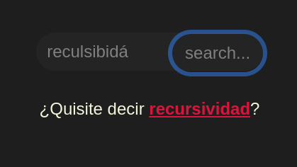
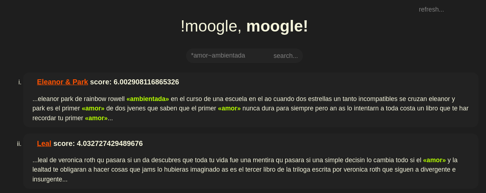

# !moogle, moogle!


> Proyecto de Programación I.
> Facultad de Matemática y Computación - Universidad de La Habana.
> Cursos 2021, 2022.
>
>- Estudiante Carlos Mauricio Reyes Escudero
>- Grupo C111

## El Inicio

Basicamente hare un resumen del funcionamiento del programa por el orden q sigue al ejecutar los metodos...desde la vista principal hasta los metodos empleados en el motor...

### Partes del programa

- `MoogleServer`: aqui se genera la interfaz grafica y esta el codigo q corre mientras la pagina funciona...
- `MoogleEngine`: El codigo behind the scenes q hace q todo funcione...

la pagina carga inicialmente....pero todo esta configurado para q todas las variables carguen primero, solo he anadido unas pocas lineas

### que es lo primero q ocurre cuando se inicializa la pagina?

```cs
private DatabaseItem Database=Moogle.StartRefresh();
```

ojo importante....esto inicia un proceso de recopilacion de datos muy importante...llama claramente al siguiente metodo q se encuentra en el `MoogleEngine`

> ⚠️ La informacion debe ponerse en la carpeta `/moogle-main/MoogleServer/wwwroot/Content/`

```cs
public static DatabaseItem StartRefresh()
    {
        return Data;
    }
```

_uff, si todo fuera asi de facil...

este metodo fue creado para q el metodo real no se ejecutara mas de una vez al cargar la pagina, al declarar una variable estatica q corriera al principio:

```cs
public static DatabaseItem Data = DatabaseRefresh();
```

> DatabaseItem no es mas q un tipo de objeto creado para almacenar las estructuras de datos usadas para q el algoritmo funcione...

Basicamente es llamado el metodo `DatabaseRefresh()` una sola vez al cargar(ya veremos q puede ser llamado cuando sea necesario luego...)

### Y q contiene este metodo?

bueno aqui va:

```cs
public static DatabaseItem DatabaseRefresh()
    {
```

ese era el inicio claro....hay cosas q no estan cerradas pero lo voy a desglozar por partes

### Cargando el indice de archivos

Lo primero q hace es cargar todas las direcciones de todos los archivos q hay en la carpeta de contenido...

```cs
var tempfiles = index("../MoogleServer/wwwroot/Content/");
```

ya eso lo hace....pero hay aun cosas fuera de contexto no?

q es `index(string x)`?

- pequena funcion recursiva q me extrae todas las direcciones en la carpeta y en todas las subcarpetas

```cs
   public static List<string> index(string url)
    {
        List<string> file = new List<string>();

        List<string> urlFiles(string url)
        {

            file.AddRange(Directory.GetFiles(url).ToList());
            foreach (string u in Directory.GetDirectories(url))
            {
                urlFiles(u);
            }
            return file;
        }
        return urlFiles(url);
    }
```

### Cargando una lista de listas(cada lista corresponde a un archivo y tiene todas sus palabras, repetidas incluso)

```cs
        var tempfileswords = new List<List<string>>();
        foreach (var item in tempfiles)
        {
            tempfileswords.Add(Normalize(System.IO.File.ReadAllText(item), "").Split().ToList());
        }
        
        foreach (var item in tempfileswords)
        {
            item.RemoveAll(textisNullorSpace);
        }
```

ya aca estan todas las palabras por documento...solo quedaria ponerlas en una estructura sin repeticiones para obtener el universo de palabras...

### Creando indice de palabras

Esto carga un array con todas las palabras y genera un diccionario con el indice(el diccionario devuelve mas rapido el llamado q el `IndexOf()` de una lista q es la otra forma en  lo tenia pensado implementar[relacionado con la forma en q gestiono las matrices])

```cs
        var tempword = new List<string>();
        foreach (var item in tempfileswords)
        {
            tempword.AddRange(item);
        }
        var tempwords = tempword.Distinct().ToArray();

        Dictionary<string, int> tempwordsdicc = new Dictionary<string, int>();
        for (int i = 0; i < tempwords.Length; i++)
        {
            tempwordsdicc.Add(tempwords[i], i);
        }
```

### Ya todo esta listo para cargar las matrices

```cs
        var files_count = tempfiles.Count;
        double b = files_count;
        var words_count = tempwords.Length;
        var matriz_TF = new double[files_count, words_count];

        for (int i = 0; i < files_count; i++)
        {
            for (int j = 0; j < tempfileswords[i].Count; j++)
            {
                matriz_TF[i, tempwordsdicc[tempfileswords[i][j]]]++;
            }
        }

         var matriz_TFIDF = new double[files_count, words_count];
        for (int j = 0; j < words_count; j++)
        {

            double curr_idf = 0;
            for (int i = 0; i < files_count; i++)
            {
                if (!(matriz_TF[i, j] == 0))
                {
                    curr_idf++;
                }
            }

            for (int i = 0; i < files_count; i++)
            {
                if (matriz_TF[i, j] != 0 && curr_idf != files_count)
                {
                    matriz_TFIDF[i, j] = TF_IDF_Calc(matriz_TF[i, j],Convert.ToDouble(tempfileswords[i].Count),b,curr_idf);
                }
            }
        }
```

ojo aqui esta el procedimiento para calcular la importancia de los archivos `TF_IDF_Calc`

```cs
    static double TF_IDF_Calc(double ConteoPalabraDocActual,double TotalPalabrasDocActual,double TotalArchivos,double TotalDocsconPalabra){
        return Compress(((ConteoPalabraDocActual / TotalPalabrasDocActual) * Math.Log(TotalArchivos / TotalDocsconPalabra))*100);
    }
```

q basicamente multiplica la frecuencia de un termino en un documento(cantidad de repeticiones de este en el documento entre el total de palabras del documento(peso en el documento actual))[vendria a ser el peso en el documento actual] por la frecuencia inversa del termino en la coleccion de documentos(Es un logaritmo de el total de documentos sobre la cantidad de documentos en q aparece la palabra...mientras mayor se aproxima a 1 y el logaritmo por ende a 0(si esta en todos no tiene valor))[vendria a significar la relevancia en la coleccion, q de aparecer mucho es menor]

y todo eso lo comprime de modo q cualquier valor por encima de un threeshold es reducido y en un limite pues queda ahi mismo:

```cs
static double Compress(double a)
    {
        if (a > 1)
        {
            a = a - 1;
            a = a / 1.5;
            a = a + 1;
        }
        if (a > 2)
        {
            a = a - 2;
            a = a / 2;
            a = a + 2;
        }
        if (a > 4)
        {
            a = a - 4;
            a = a / 5;
            a = a + 4;
        }
        if (a > 8)
        {
            a = a - 8;
            a = a / 100;
            a = a + 8;
        }
        if (a > 10)
        {
            a = 10;
        }
        return a;
    }
```

y bueno retorna todo lo q obtuvo de los archivos

```cs
  return new DatabaseItem(tempfiles, tempwordsdicc, tempwords, tempfileswords, matriz_TFIDF);
```

Ha sido creada con exito la base de informacion sobre la q va a operar la pagina...

tambien se puede actualizar manualmente, para ello hay un boton, localizado en la parte superior derecha:


```html
<button id="refreshbutton" type="default" class="btn btn-primary" @onclick="RunRefresh">refresh...</button>
```

q llama a `RunRefresh`

```cs
    private void RunRefresh() {
       Database=Moogle.DatabaseRefresh();
    }
```

y ya saben eso q hace...

## Realizando una busqueda

La busqueda se puede realizar de dos maneras...para ello pondre los elementos q las traen...



La `entrada de texto`

```html
<input @onkeydown="keyEnter" @onkeypress="keyEnter" @onkeyup="keyEnter" id="searchentry" class="p-1 my-4" @bind="query" placeholder="busque algo..." >
```

...el `boton de busqueda`

```html
<button id="buttonentry" type="default" class="btn btn-primary" @onclick="RunQuery">search...</button>
```

...la `sugerencia`

```html
@if (!string.IsNullOrEmpty(result.Suggestion)) {
    <div class="suggestion">
        <p id="text">¿Quisite decir <strong ><a id="enlacesugg" @onclick="RunSuggest" href="#">@result.Suggestion</a></strong>?</p>
    </div>
}
```

como podemos apreciar el boton de busqueda llama directo a `RunQuery()` pero el `text entry` llama a `keyEnter()`...pero no hay lio, el segundo solo llama al primero si la tecla `Enter` es presionada....y bueno la `sugerencia` llama a `RunSuggest()` q es `RunQuery()` con la `sugerencia` en lugar del `query` como parametro...

```cs
private string query = "";
private string keyPressed = "";
private SearchResult result = new SearchResult();

private void RunQuery() {
       result = Moogle.Query(query, Database);
    }

private void keyEnter(KeyboardEventArgs args) {   
    if (args.Key=="Enter"){
        keyPressed=args.Key;
        result = Moogle.Query(query, Database);
    }

private void RunSuggest() {
        query=result.Suggestion;
       result = Moogle.Query(result.Suggestion, Database);      
    }    
```

todos llaman al metodo `Query(string query, DatabaseItem Data)` q es el q se encarga de todo el proceso, entonces...

### ...comienza la busqueda

## El metodo `Query()`

```cs
public static SearchResult Query(string query, DatabaseItem Data)
{
    var listed_query = Normalize(query, true, false).Split().ToList().Distinct().ToList();
        listed_query.RemoveAll(textisNullorSpace);
        var operatmatrix = Operators(Normalize(query, true, true).Split().ToList(), listed_query);
        var presearchitems = new List<SearchItem>();
```

y por aqui tenemos algunas cosas

- el metodo `Normalize()` q me normaliza las palabras(puede dejar solo palabras, solo simbolos(operadores), o ambos)
- el metodo `Operators()` q toma la entrada y asocia los operadores a las palabras...lo pondre a continuacion:

```cs
static List<int[,]> Operators(List<string> querywithmods, List<string> querywithoutmods)
    {
        querywithmods.RemoveAll(textisNullorSpace);
        var listofoperators = new List<int[,]>();
        listofoperators.Add(new int[querywithoutmods.Count, 3]);
        for (int i = 0; i < querywithmods.Count; i++)
        {
            if ((i != querywithmods.Count - 1) && (querywithmods[i] == "~") && (querywithoutmods.Contains(Normalize(querywithmods[i + 1], true, false)) && querywithoutmods.Contains(Normalize(querywithmods[i - 1], true, false))))
            {
                listofoperators.Add(new int[2, 1]);
                listofoperators[listofoperators.Count - 1][0, 0] = querywithoutmods.IndexOf(Normalize(querywithmods[i - 1], true, false));
                listofoperators[listofoperators.Count - 1][1, 0] = querywithoutmods.IndexOf(Normalize(querywithmods[i + 1], true, false));
            }
        }
        int a;
        int[] b = new int[3];
        foreach (var item in querywithmods)
        {
            if (querywithoutmods.Contains(Normalize(item, true, false)))
            {
                a = querywithoutmods.IndexOf(Normalize(item, true, false));
                b = AddOperators(item, new int[3]);
                listofoperators[0][a, 0] += b[0];
                listofoperators[0][a, 1] += b[1];
                listofoperators[0][a, 2] += b[2] + 1;
            }
        }
        return listofoperators;
    }
```

este crea una matriz q vincula los operadores con las palabras del query y saca la cantidad de operadores por palabra con el metodo `AddOperators()`

```cs
static int[] AddOperators(string texto, int[] extracted_op)
    {
        if (texto.Length == 1)
            return extracted_op;

        if (texto.StartsWith("!"))
        {
            extracted_op[0]++;
            return AddOperators(texto.Substring(1), extracted_op);
        }
        else if (texto.StartsWith("^"))
        {
            extracted_op[1]++;
            return AddOperators(texto.Substring(1), extracted_op);
        }
        else if (texto.StartsWith("*"))
        {
            extracted_op[2]++;
            return AddOperators(texto.Substring(1), extracted_op);
        }
        else
        {
            return extracted_op;
        }

    }
```

listos los operadores,comienza la busqueda:

(continua `Query()`)

```cs
 for (int i = 0; i < Data.Files.Count; i++)
        {
            double scr = 0;
            foreach (var elem in listed_query)
            {
                if (operatmatrix[0][listed_query.IndexOf(elem), 0] > 0)
                {
                    if ((Data.FilesWords[i].Contains(elem)))
                    {
                        scr = 0;
                        break;
                    }
                }
                if (operatmatrix[0][listed_query.IndexOf(elem), 1] > 0)
                {
                    if (!(Data.FilesWords[i].Contains(elem)))
                    {
                        scr = 0;
                        break;
                    }
                }
                if (Data.FilesWords[i].Contains(elem))
                {
                    scr = scr + ((Data.TfIdf[i, Data.Words[elem]]) * Math.Pow(operatmatrix[0][listed_query.IndexOf(elem), 2], operatmatrix[0][listed_query.IndexOf(elem), 2]));
                }
            }

            for (int j = 1; j < operatmatrix.Count; j++)
            {
                if ((Data.FilesWords[i].Contains(listed_query[operatmatrix[j][0, 0]])) && (Data.FilesWords[i].Contains(listed_query[operatmatrix[j][1, 0]])))
                {
                    int a = Data.FilesWords[i].Count;
                    List<int> b = new List<int>();
                    List<int> c = new List<int>();
                    for (int k = 0; k < a; k++)
                    {
                        if (Data.FilesWords[i][k] == listed_query[operatmatrix[j][0, 0]])
                        {
                            b.Add(k);
                        }
                        else if (Data.FilesWords[i][k] == listed_query[operatmatrix[j][1, 0]])
                        {
                            c.Add(k);
                        }
                    }
                    List<int> d = new List<int>();
                    foreach (var itb in b)
                    {
                        foreach (var itc in c)
                        {
                            if (itb > itc)
                            {
                                d.Add(itb - itc);
                            }
                            else
                            {
                                d.Add(itc - itb);
                            }

                        }
                    }
                    double e = d.Min();
                 
                    scr = scr + (scr * Math.Log(a / e));
                }
            }
            scr=Compress(scr);
            presearchitems.Add(new SearchItem(Path.GetFileNameWithoutExtension(Data.Files[i]), GenerarSnippet(scr, listed_query, i, 60, Data), scr, GenerarURL(Data.Files[i], Data)));
        }

        presearchitems.RemoveAll(scoreiszero);
        var ordereditems = presearchitems.OrderByDescending(x => x.Score).ToArray();
    
        return new SearchResult(ordereditems, ConstruirSugerencia(listed_query, Data));
    }
```

Como se puede apreciar en esta parte se asigna el valor a los documentos y se devuelven los q cumplan los requisitos...pasa entonces por un...

### ...proceso de filtrado:

- revisa si tiene el operador `!` e iguala el score a 0 si lo tiene y el documento contiene la palabra...
- revisa si tiene el operador `^` e iguala el score a 0 si lo tiene y el documento `no` contiene la palabra...
- procede a calcular el score sumando el valor del `TFIDF` en la posicion correspondiente y sumando un excedente si la palabra contiene el operador `*` de manera q siendo x el conteo de este suma `((x+1)^(x+1))*score` de manera q si no lo incluye seria `1^1=1` y si lo incluye aumenta el valor exponencialmente
- si el documento contiene alguno de los pares de palabras vinculados por el operador `~` entonces sumara al score un exedente de la forma `score*Log(CantidadDePalabrasDelDocumento/DistanciaMinimaEntreLasPalabras)`, con lo q a menor distancia mayor valor va a ser sumado....y si estan en los extremos nada sera sumado...

a continuacion se agrega un objeto del tipo `SearchItem()` al cual se le pasan por los correspondientes parametros los valores...

```cs
presearchitems.Add(new SearchItem(Path.GetFileNameWithoutExtension(Data.Files[i]), GenerarSnippet(scr, listed_query, i, 60, Data), scr, GenerarURL(Data.Files[i], Data)));
```

- `Title` -> `Path.GetFileNameWithoutExtension(Data.Files[i])` este extrae el nombre del archivo sin la extension
- `Snippet` -> `GenerarSnippet(scr, listed_query, i, 60, Data)` este metodo genera el Snippet tomando el fragmento cuya sumatoria de scores locales al archivo sea mayoy y multiplicando por un valor muy grande el perteneciente a las palabras buscadas(metodo `sub_array_sumamaxima` siendo cada valor un `TFIDF`)`[codigo a continuacion]`
- `Score` -> `scr` El valor del score obtenido
- `URL` -> `GenerarURL(Data.Files[i], Data)` esto me elimina una parte del texto para q la direccion sea valida desde la pagina...

### `GenerarSnippet()`

```cs
static List<string> GenerarSnippet(double valscr, List<string> listquery, int filepos, int longitud, DatabaseItem Data)
    {
        if (valscr == 0)
        {
            return new List<string>();
        }
        List<string> esnipet = new List<string>();
        int palabrasdeldocumento = Data.FilesWords[filepos].Count;

        if (palabrasdeldocumento < longitud || palabrasdeldocumento == longitud)
        {
            for (int i = 0; i < palabrasdeldocumento; i++)
            {
                esnipet.Add(Data.FilesWords[filepos][i]);

            }
            return esnipet;
        }
        else
        {
            double curr = 0;
            int indexofmostimportant = 0;
            foreach (var item in listquery)
            {
                if (Data.Words.Keys.ToList().Contains(item))
                {
                    if (Data.TfIdf[filepos, Data.Words[item]] > curr)
                    {
                        curr = Data.TfIdf[filepos, Data.Words[item]];
                        indexofmostimportant = listquery.IndexOf((string)item);
                    }
                }

            }
            var thewordindex = Data.FilesWords[filepos].IndexOf(listquery[indexofmostimportant]);

            int start = Math.Max(0, (thewordindex - (longitud - 1)));
            int end = Math.Min((palabrasdeldocumento - 1 - longitud), (thewordindex + 1));
            int maxindex = start;

            double currentcount = 0;
            for (int j = start; j < start + longitud; j++)
            {
                currentcount = currentcount + (Data.TfIdf[filepos, Data.Words[Data.FilesWords[filepos][j]]] + 1000 * Enumerable.Count<string>(listquery, (Func<string, bool>)(x => x == Data.FilesWords[filepos][j])));
            }
            double max = currentcount;
            for (int i = start + 1; i < end; i++)
            {
                currentcount = currentcount - (Data.TfIdf[filepos, Data.Words[Data.FilesWords[filepos][i - 1]]] + 1000 * Enumerable.Count<string>(listquery, (Func<string, bool>)(x => x == Data.FilesWords[filepos][i - 1])));
                currentcount = currentcount + (Data.TfIdf[filepos, Data.Words[Data.FilesWords[filepos][i + longitud]]] + 1000 * Enumerable.Count<string>(listquery, (Func<string, bool>)(x => x == Data.FilesWords[filepos][i + longitud])));

                if (currentcount > max)
                {
                    max = currentcount;
                    maxindex = i;
                }
            }

            for (int i = 0; i < longitud; i++)
            {
                esnipet.Add(Data.FilesWords[filepos][maxindex + i]);
            }
            return esnipet;
        }
    }
```

### `GenerarURL()`

```cs
static string GenerarURL(string initurl, DatabaseItem Data)
    {
        StringBuilder midurl = new StringBuilder();
        midurl.Append(initurl);
        midurl.Remove(3, 21);
        return midurl.ToString();
    }
```

### Solo le falta retornar el resultado que la pagina muestra...

```cs
return new SearchResult(ordereditems, ConstruirSugerencia(listed_query, Data));
```

A este le pasa:

- `items` -> `ordereditems` q son los resultados q ha obtenido con `score>0`
- `suggestion` -> `ConstruirSugerencia(listed_query, Data)`...q utiliza un sistema llamado `Edit_Distance` para determinar cuan cercana es una palabra a otra...

### `ConstruirSugerencia()`

```cs
 static string ConstruirSugerencia(List<string> fromquery, DatabaseItem Data)
    {
        bool todosbien = true;
        foreach (var item in fromquery)
        {
            if (!Data.WordsList.Contains(item))
            {
                todosbien = false;
            }
        }

        if (todosbien) { return ""; }
        else
        {
            StringBuilder presuggest = new StringBuilder();
            foreach (var item in fromquery)
            {
                if (Data.WordsList.Contains(item))
                {
                    presuggest.Append(item);
                    presuggest.Append(" ");
                }
                else
                {
                    int eddis = 5;
                    int indexzero = 0;
                    int tfidfdifzero = -1;
                    for (int i = 0; i < Data.Words.Count; i++)
                    {
                        if (Edit_Distance(item, Data.WordsList[i]) < eddis)
                        {
                            eddis = Edit_Distance(item, Data.WordsList[i]);
                            indexzero = i;
                            int count = 0;
                            for (int j = 0; j < Data.Files.Count; j++)
                            {
                                if (Data.TfIdf[j, i] != 0)
                                {
                                    count++;
                                }
                            }
                            tfidfdifzero = count;
                        }
                        else if (Edit_Distance(item, Data.WordsList[i]) == eddis)
                        {
                            int count = 0;
                            for (int j = 0; j < Data.Files.Count; j++)
                            {
                                if (Data.TfIdf[j, i] != 0)
                                {
                                    count++;
                                }
                            }
                            if (count > tfidfdifzero)
                            {
                                tfidfdifzero = count;
                                indexzero = i;
                            }

                        }
                    }
                    if (eddis < 4)
                    {
                        presuggest.Append(Data.WordsList[indexzero]);
                        presuggest.Append(" ");
                    }
                    else
                    {
                        presuggest.Append(item);
                        presuggest.Append(" ");
                    }
                }
            }
            return presuggest.Remove(presuggest.Length - 1, 1).ToString();
        }
    }
```

### Como se puede apreciar va midiendo la distancia con el metodo `Edit_Distance()`

```cs
static int Edit_Distance(string l, string ll)
    {
        int[,] cuadro = new int[l.Length + 1, ll.Length + 1];
        for (int i = 0; i < l.Length + 1; i++)
        {
            cuadro[i, 0] = i;
        }
        for (int i = 1; i < ll.Length + 1; i++)
        {
            cuadro[0, i] = i;
        }


        for (int i = 1; i < l.Length + 1; i++)
        {
            for (int j = 1; j < ll.Length + 1; j++)
            {
                if (l[i - 1] == ll[j - 1])
                {
                    cuadro[i, j] = (Math.Min(cuadro[i - 1, j - 1], Math.Min(cuadro[i - 1, j], (cuadro[i, j - 1]))));
                }
                else
                {
                    cuadro[i, j] = (Math.Min(cuadro[i - 1, j - 1], Math.Min(cuadro[i - 1, j], (cuadro[i, j - 1])))) + 1;
                }
            }
        }


        return cuadro[l.Length, ll.Length];
    }
```

## Con esto la pagina muestra los resultados...


# Resultado



> Para resaltar las palabras solo use un `for` con ciertas condiciones en la construccion en `Index.razor` tal q agregara las `comillas` y `etiquetas` correspondientes en la implementacion entre este y el `css`

# Gracias por leer
